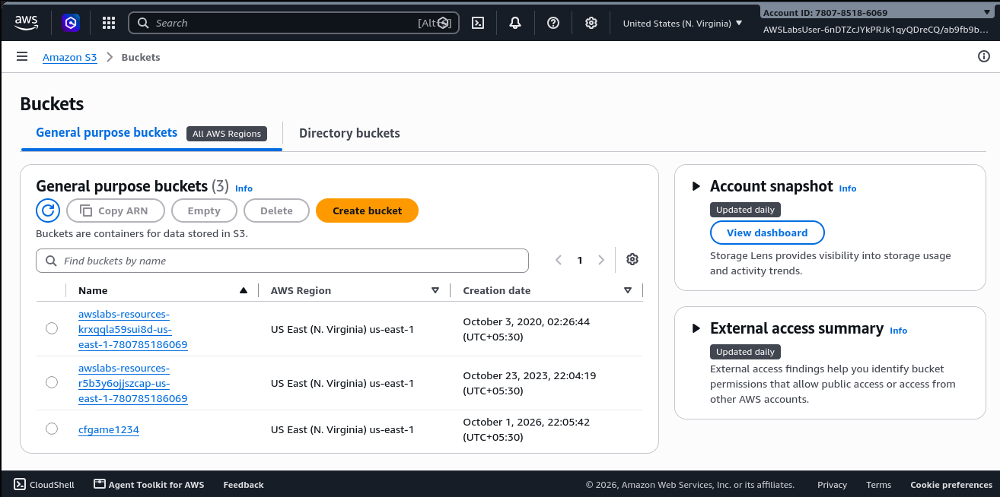
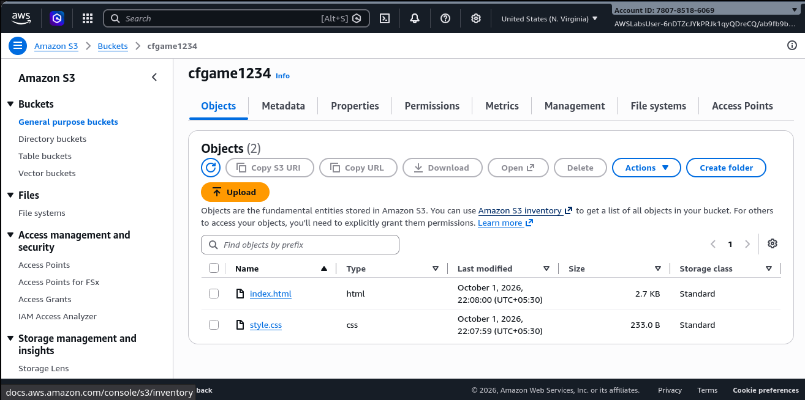
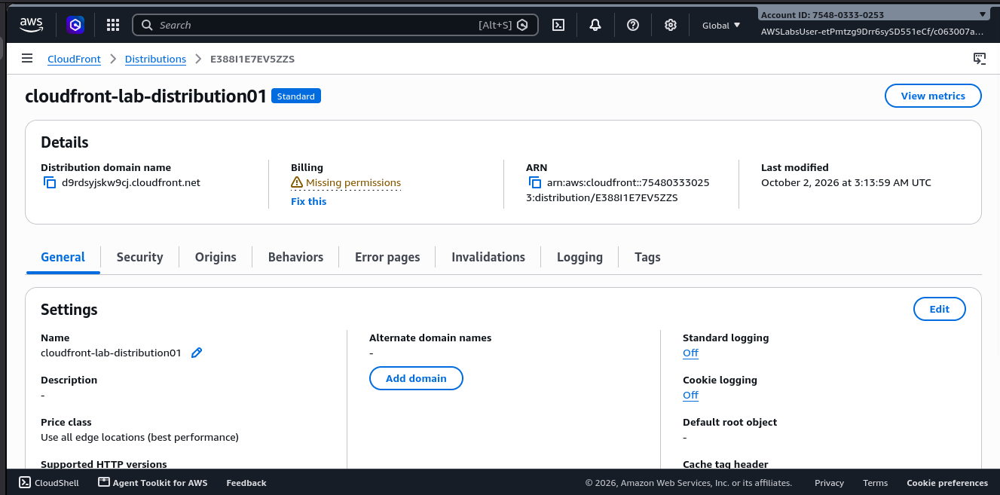
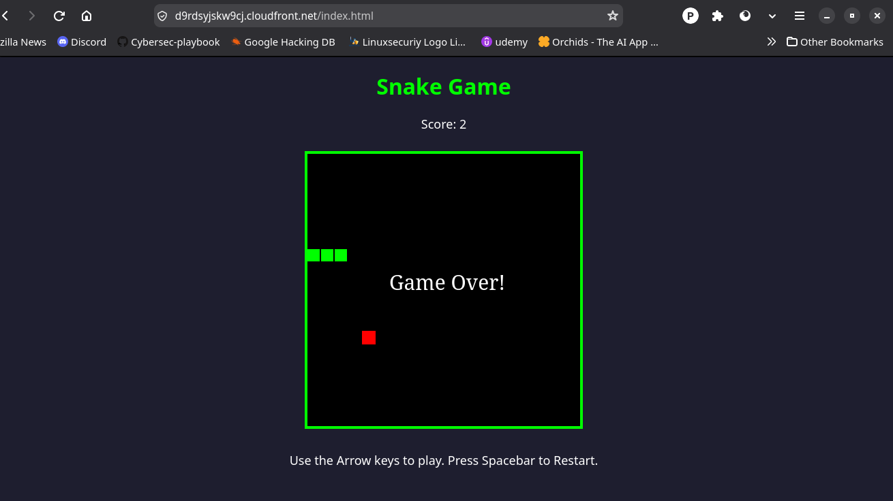

# aws-static-website-game-s3-cloudfront
Static Snake Game deployed on AWS using Amazon S3 and CloudFront, with documented architecture, deployment steps, and AWS lab troubleshooting.

This project documents my hands-on deployment of a simple Snake Game using Amazon S3 and Amazon CloudFront.

I built the website using only HTML and CSS, and then used the AWS Skill Builder lab environment to upload the files to S3 and configure CloudFront. The purpose of this exercise was not just to deploy the website, but to understand the actual process of storing website files in S3, connecting S3 with CloudFront, and troubleshooting a permission-related problem during the setup.

1. Creating the S3 Bucket

I started by creating an Amazon S3 bucket named:

cfgame1234

The bucket was created in the AWS Skill Builder lab environment.

  

At this stage, my main objective was to create the storage location where I would keep the website files.

2. Uploading the Website Files

After creating the bucket, I uploaded the two files required for the website:

index.html
style.css

index.html contains the structure and content of the Snake Game, while style.css contains its styling.

  

This gave me the basic website files inside the S3 bucket.

3. Setting Up Amazon CloudFront

Once the files were uploaded to S3, the next step was to put Amazon CloudFront in front of the S3 content.

I created a CloudFront distribution and selected the S3 bucket as the origin.

  

The idea was to access the website through the CloudFront distribution instead of working only with the S3 bucket.

4. Problem I Faced

While configuring CloudFront, I tried to use index.html as the Default Root Object.

However, the AWS Skill Builder lab identity did not have permission to update the CloudFront distribution. The error indicated that the required permission was:

cloudfront:UpdateDistribution

So I could not simply change the CloudFront configuration or modify the IAM permissions myself.

This was an actual restriction of the lab environment, not an error in the website files.

5. How I Solved It

Instead of trying to bypass the permission restriction, I looked for another way to access the file that was already available through the CloudFront distribution.

I used the direct path:

https://d9rdsyjskw9cj.cloudfront.net/index.html

The important part here was that I already knew the actual filename was index.html, so I requested that file directly rather than relying on the default root object configuration.

This allowed me to continue testing the deployed website without changing the restricted IAM configuration.

6. Final Result

After completing the S3 upload and CloudFront configuration, I was able to access the Snake Game through the CloudFront URL.

  

The final result was a working static Snake Game whose files were stored in Amazon S3 and accessed through the CloudFront distribution.

What I Actually Practiced

Through this deployment, I worked through the complete flow myself:

Created the S3 bucket cfgame1234.

Uploaded index.html and style.css.

Created a CloudFront distribution using the S3 bucket as the origin.

Encountered an IAM permission restriction while configuring the Default Root Object.

Identified the missing cloudfront:UpdateDistribution permission.

Decided not to modify or bypass the lab's IAM restrictions.

Used the direct /index.html path to access the website through CloudFront.

Verified the final Snake Game deployment.

AWS Services Used

Amazon S3 — used to store the website files.

Amazon CloudFront — used to access and deliver the website through the CloudFront distribution.

AWS Skill Builder — used as the hands-on lab environment.

Lab Note

The CloudFront URL shown in this documentation was created inside the temporary AWS Skill Builder lab environment. Because the lab environment is temporary, the URL may no longer be accessible after the lab session.

